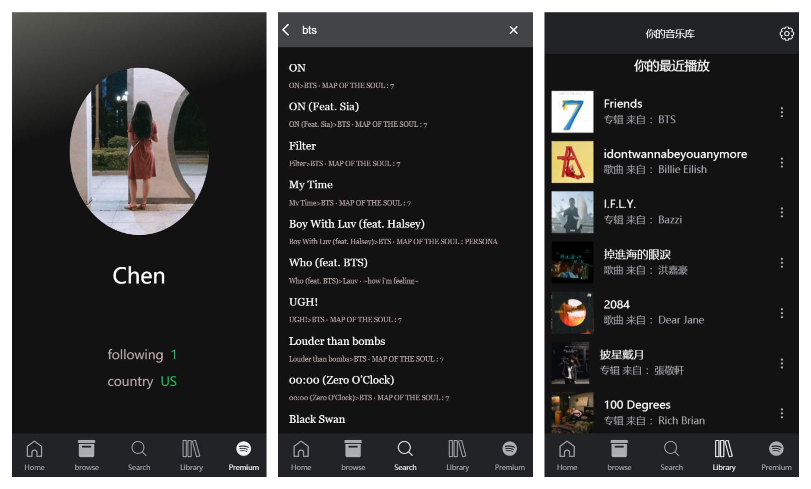
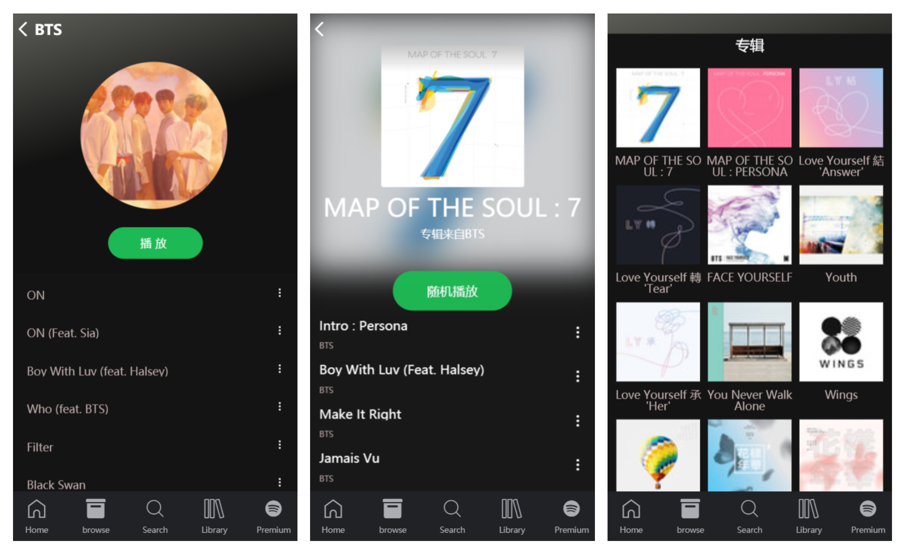

# react-spotify-clone
> A web app with spotify api use personal user true data

## Built with

- Spotify Web API
- Create React App
- Redux
- React-router
- Immutable
- Axios
- Better-scroll
- Express
- React-Router
- Styled Components
- ...

## Setup
Register a Spotify App and add http://localhost:8888/callback as a Redirect URI in the app settings

1. Install dependencies
```
cd server     
npm install       
```

2. set your environment variables in powershell
```
$env:SPOTIFY_CLIENT_ID="your clientId"      
$env:SPOTIFY_CLIENT_SECRET="your ClientSecret"      
$env:path=$env:path + ";your app Absolute path"       
```
3. run it
```
npm start
```
4. run client
```
cd client
npm install 
npm start
```
5. run server at `http://localhost:8888/login`，Automatically jump to `http://localhost:3000/recommend` after authorization.

## overview




## hard work
- Flux
- Async problem
- CSSTransition
- Complex api
- User authentication
- Scroll
- design Component

## About

Still updating...🙇🏻‍♀️

Contact with me 👉 <chenyanke00@outlook.com> 